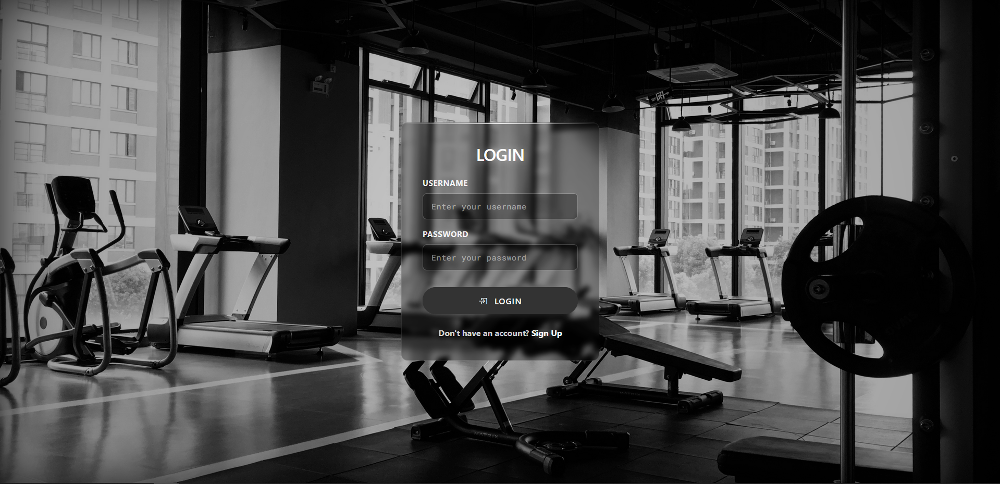
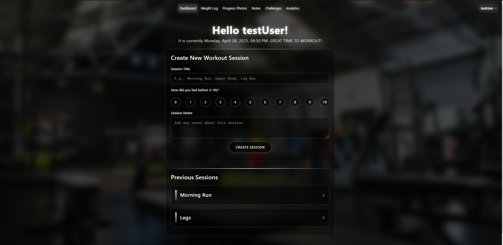
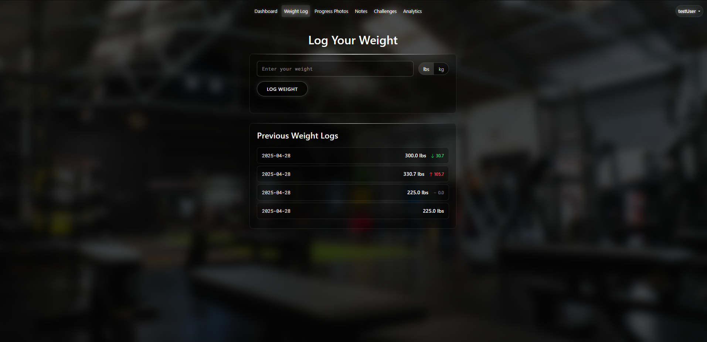

# Fitness Tracker


Access: https://fitness-tracker-ezp6.onrender.com

## **About**
I built this project in my second year of university to further develop my programming skills while combining my passion for fitness. During my high school co-op at Apple in 2021, I created a similar fitness app using Xcode and Swift. Since then, I have gained significant experience and wanted to challenge myself by building a full-stack application from scratch. In the future, I hope to revisit this project and deploy a mobile version to the App Store.

While this is a full-stack, web-based application, my primary focus was on backend development and data management. I integrated Supabase as the backend service, enabling secure cloud-based storage for both user data and media uploads. This structure ensures that all content is efficiently organized and scalable for future enhancements.

## Here are some screenshots of the application

### **Home Page**

The updated home page offers a more professional yet minimalist appearance. It provides a clear overview of the app’s core features, helping users quickly understand its purpose. Login and Register buttons are prominently displayed, guiding users to seamlessly begin using the application.

### **Sign Up Page**

The updated Sign Up page maintains a clean, minimalist design consistent with the overall app theme. Set against a fitness-inspired background, the form is simple and intuitive, allowing users to easily create an account with minimal distractions. Clear input fields and a prominent Register button streamline the onboarding process, helping users get started quickly.

### **Login Page**

The updated Login page continues the minimalist and professional theme, providing users with a clean and focused experience. Set against the same fitness background, the form ensures easy access for returning users. Clear input fields and a bold Login button make the process straightforward, reducing friction for users resuming their fitness tracking journey.

### **Dashboard**

The updated Dashboard provides users with a streamlined experience to log and track their workout sessions. The welcoming header and real-time date and time create a personalized feel, while the minimalist session creation form allows users to quickly input workout details and rate their session. Below, previous sessions are displayed in a clean, expandable format for easy access and review, enhancing both usability and long-term tracking.

### **Creating a new Session**


### **Editing Exercises within a session**


### **Logging your weight**

The Weight Log page provides users with a simple and efficient way to track their weight over time. Users can quickly input their weight in pounds or kilograms, while previous entries are neatly displayed below, including color-coded indicators for changes. This clean, organized layout helps users easily monitor their progress and stay motivated toward their fitness goals.

### **Uploading media specific to an exercise**


### **Updating how you feel post worokuts**


### **Deleting media within exercises**

---

## ⚡ Technologies Used
- **Flask** (Backend Framework)
- **Flask-WTF** (Form Handling and Validation)
- **Flask-Login** (User Authentication and Session Management)
- **Supabase** (PostgreSQL Database and Cloud Storage)
- **SQLAlchemy** (ORM for Database Interactions)
- **Bootstrap 5** (Frontend Styling)
- **Jinja2** (HTML Templating Engine)
- **Chart.js** (Data Visualization)
- **Render** (Deployment Platform)

## Installation and Setup 
1. Clone the repository

    ```bash
    git clone https://github.com/emaadq/Fitness-Tracker.git
    ```

2. Go to the repository

    ```bash
    cd Fitness-Tracker
    ```

3. Create and activate a virtual environment

    ```bash
    python -m venv venv
    ```

    If you are on Windows, use:

    ```bash
    venv\Scripts\activate
    ```

    If you are on MacOS, use:

    ```bash
    source venv/bin/activate
    ```

4. Install relevant dependencies

    ```bash
    pip install -r requirements.txt
    ```

5. Run the application

    Using Python:

    ```bash
    py main.py
    ```

    Or using Flask CLI:

    ```bash
    flask run
    ```

6. Access the application

    Visit [http://localhost:5000](http://localhost:5000) in your browser.


## License
This project is licensed under the MIT License - see the LICENSE file for details.
