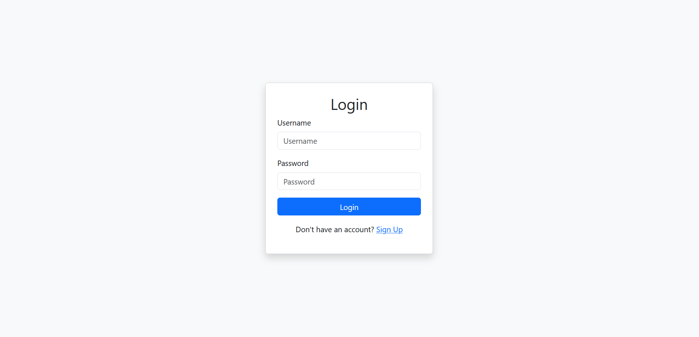
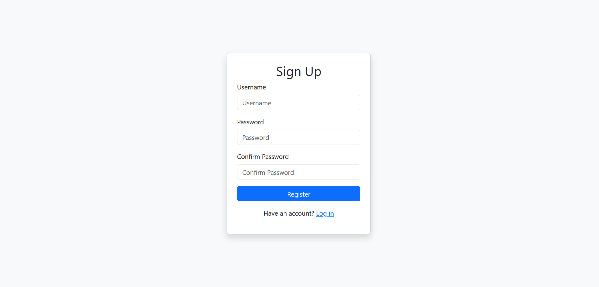
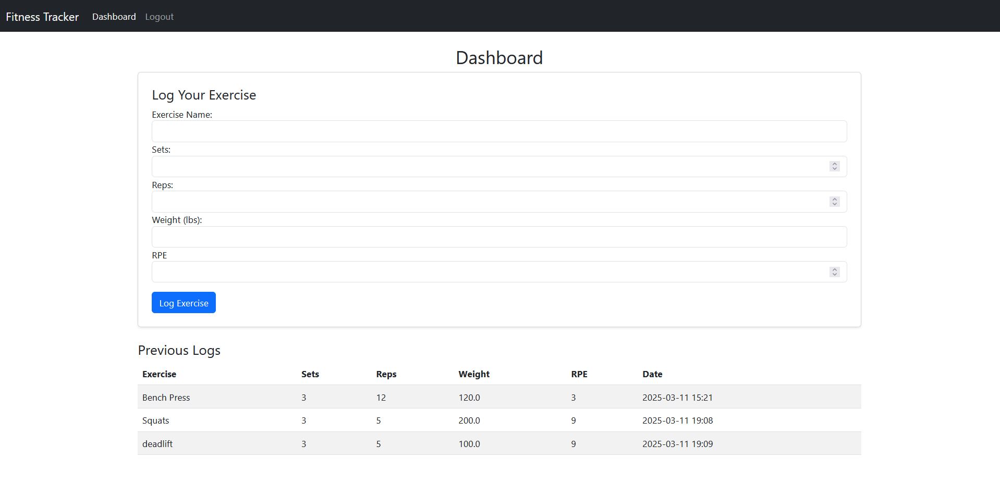
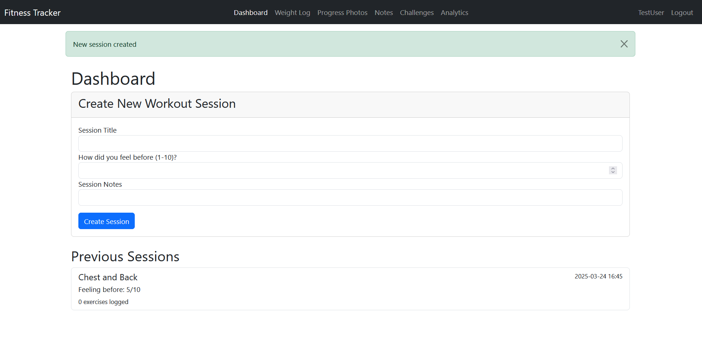
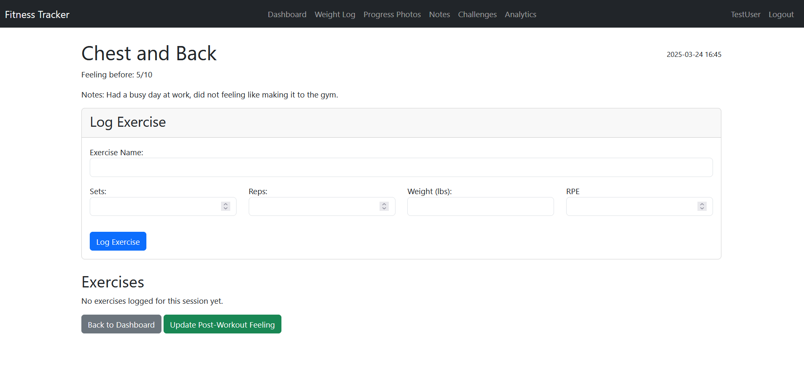
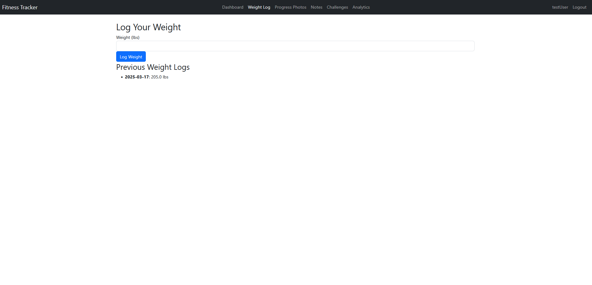
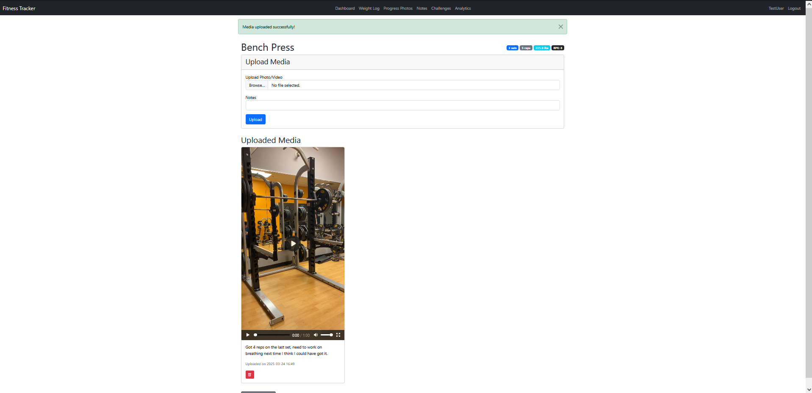
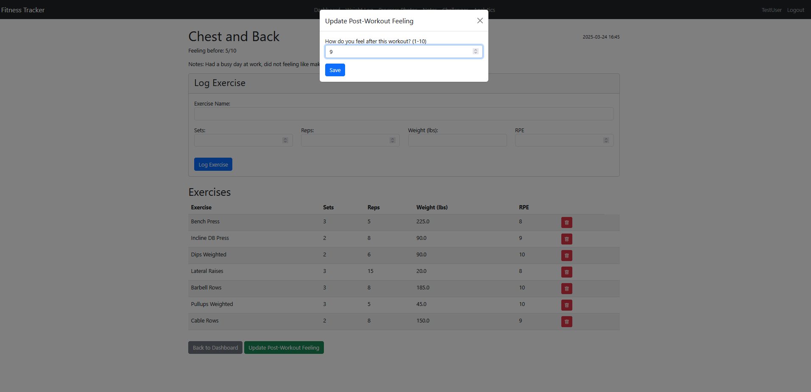
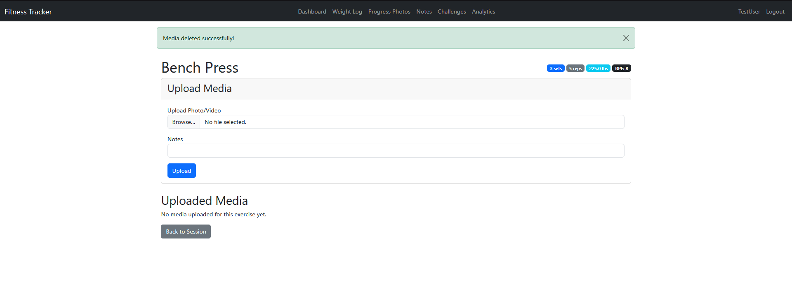

# Fitness Tracker

v

## **Why I Built This**
I created this **Fitness Tracker** to explore new technologies while working on something I’m passionate about—fitness. As a fitness fanatic, I wanted a project that would not only improve my programming and application development skills but also allow me to experiment with features I wish existed in popular fitness apps today.

Throughout this project, I’ve gained experience in:

    User authentication & form validation
    Database synchronization with SQLite & Flask
    Front-end design using Bootstrap
    Integrating various Python packages in Flask

This project serves as both a learning experience and a tool that I can continue expanding with new features over time. 🚀

--

A **Flask-based Fitness Tracker** that allows users to register, log in, and track their workouts. Workout tracker metrics include
**sets, reps, weights, and RPE**. The project uses **Bootstrap 5** for UI styling.

---

## Here are some screenshots of the application

### **Login Page**

### **Sign Up Page**

### **Dashboard**

### **Creating a new Session**

### **Editing Exercises within a session**

### **Logging your weight**

### **Uploading media specific to an exercise**

### **Updating how you feel post worokuts**

### **Deleting media within exercises**

---

## ⚡ Technologies Used
- **Flask** (Backend)
- **Flask-WTF** (Form Handling)
- **Flask-Login** (User Authentication)
- **SQLite** (Database)
- **SQLAlchemy** (ORM)
- **Bootstrap 5** (Frontend)
- **Jinja2** (Templating)
- **Chart.js** (Data Visualization)

## Installation and Setup 
1. Clone the repository 
git clone https://github.com/emaadq/Fitness-Tracker.git
cd Fitness-Tracker

2. Create and activate a virtual environment
python -m venv venv 
venv\Scripts\Activate (Windows)\n
source venv\bin\activate (MacOS)

3. Install relevant dependencies
pip install -r requirements.txt

4. Run the application
py main.py 
or
flask run

5. Access the application at 'http://localhost:5000'

## Future Enhancements
- Social features: friend connections and shared workouts
- Nutrition tracking integration
- Advanced analytics and recommendations
- Mobile app development
- Integration with fitness devices and wearables

## License
This project is licensed under the MIT License - see the LICENSE file for details.